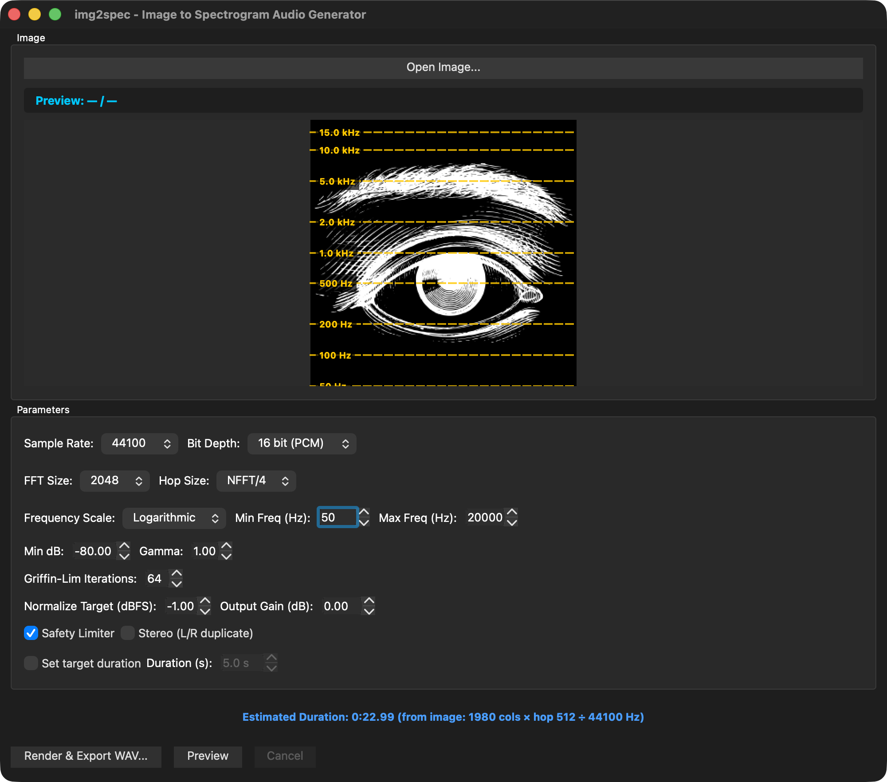

# img2spec - Image to Spectrogram Audio Generator

Convert images (PNG/JPG) into audio by interpreting them as spectrograms. Uses the Griffin-Lim algorithm for phase reconstruction and ISTFT for high-quality audio synthesis.

## Screenshots


*Main application window with image preview and parameter controls*


*Logarithmic frequency scale with visual guides*


*Real-time rendering progress with Griffin-Lim iterations*

## Features

- **Cross-platform**: Windows and macOS support
- **Image formats**: PNG, JPG (auto-converts color to grayscale)
- **Audio output**: WAV format with multiple options:
  - Sample rates: 44.1kHz, 48kHz, 96kHz
  - Bit depths: 16-bit PCM, 24-bit PCM, 32-bit Float
  - Mono or Stereo (L/R duplicate)
- **DSP controls**:
  - FFT size: 1024, 2048, 4096
  - Hop size: NFFT/2, NFFT/4, NFFT/8
  - Frequency scale: Linear, Logarithmic (20Hz - 20kHz configurable)
  - Brightness mapping: minDb, gamma correction
  - Griffin-Lim iterations (16-256)
  - Normalize, Output Gain, Safety Limiter
- **Enhanced UX**:
  - Visual frequency guides on image preview (logarithmic mode)
  - Real-time audio duration estimation
  - Drag & drop support for images
  - Detailed progress dialog during rendering

## Technology Stack

- **GUI**: Qt6 (cross-platform UI)
- **FFT**: kissfft (lightweight, BSD license)
- **Audio I/O**: libsndfile (supports all PCM formats)
- **Image loading**: stb_image (PNG/JPG support)
- **Build**: CMake 3.20+

## Build Requirements

### macOS

```bash
# Install Qt6
brew install qt6

# Install libsndfile (optional, will be fetched if not found)
brew install libsndfile

# Install CMake (if needed)
brew install cmake
```

### Windows

1. Install Qt6 from https://www.qt.io/download
2. Install CMake from https://cmake.org/download/
3. Install Visual Studio 2019 or later with C++ support

## Building

### macOS

```bash
# Clone the repository
cd /path/to/img2spec

# Create build directory
mkdir build
cd build

# Configure (specify Qt6 path if needed)
cmake .. -DCMAKE_PREFIX_PATH=/opt/homebrew/opt/qt@6

# Build
cmake --build . --config Release

# Run
./img2spec
```

### Windows (Visual Studio)

```bash
# Open Developer Command Prompt
cd C:\path\to\img2spec

# Create build directory
mkdir build
cd build

# Configure (specify Qt6 path)
cmake .. -DCMAKE_PREFIX_PATH=C:\Qt\6.x.x\msvc2019_64

# Build
cmake --build . --config Release

# Run
Release\img2spec.exe
```

## Usage

### Quick Start

1. **Launch the application**:
   ```bash
   ./build/img2spec.app/Contents/MacOS/img2spec
   ```

2. **Open Image**:
   - **Method 1**: Click "Open Image..." and select a PNG or JPG file
   - **Method 2**: Drag and drop an image file onto the application window
   - Color images are automatically converted to grayscale
   - Alpha channel is ignored
   - Preview appears in the window

3. **Review Audio Duration**:
   - The estimated output duration is displayed below the parameters
   - Calculated based on: `(Image Width × Hop Size) / Sample Rate`
   - Adjust hop size and sample rate to control duration

4. **Adjust Parameters**: Configure settings for your desired output
   - Start with defaults for first test
   - Recommended settings for good quality:
     - Sample Rate: 48000 Hz
     - Bit Depth: 24 bit (PCM)
     - FFT Size: 2048
     - Hop Size: NFFT/4
     - Frequency Scale: Logarithmic
     - Min Freq: 20 Hz, Max Freq: 20000 Hz
     - Griffin-Lim Iterations: 64

5. **Frequency Guides** (Logarithmic mode only):
   - Visual guides show frequency positions on the image
   - Common frequencies marked: 50Hz, 100Hz, 200Hz, 500Hz, 1kHz, 2kHz, 5kHz, 10kHz, 15kHz
   - Helps understand which parts of the image correspond to which frequencies

6. **Render**: Click "Render & Export WAV..."
   - Choose save location for WAV file
   - Progress dialog shows detailed rendering status:
     - Spectrogram building
     - Griffin-Lim iterations (with count)
     - Post-processing
     - WAV file writing
   - Success dialog displays when complete

7. **Listen**: Open the generated WAV file in any audio player or DAW

### Parameter Guide

- **FFT Size**: Larger = better frequency resolution, longer processing
- **Hop Size**: Smaller = smoother time resolution, longer audio duration
- **Frequency Scale**:
  - **Linear**: Direct pixel-to-bin mapping (uniform frequency distribution)
  - **Logarithmic**: Perceptual mapping (more resolution in low frequencies)
- **Min Freq / Max Freq**: Frequency range for logarithmic mapping (20Hz - 20kHz default)
- **Min dB**: Controls dynamic range (black pixel amplitude)
- **Gamma**: Brightness curve (>1 = brighter, <1 = darker)
- **Griffin-Lim Iterations**: More = better phase estimation (diminishing returns >64)
- **Normalize Target**: Peak level in dBFS (recommended: -1 dBFS)
- **Output Gain**: Additional volume adjustment
- **Safety Limiter**: Prevents clipping with soft limiting

## Implementation Status

### STEP 1: ✅ Image Loading & Preview
- [x] PNG/JPG loading with stb_image
- [x] Auto grayscale conversion (RGB → luminance)
- [x] Alpha channel ignored
- [x] Image preview in GUI
- [x] Bilinear resampling

### STEP 2: ✅ Audio Generation
- [x] Spectrogram builder (linear frequency mapping)
- [x] Griffin-Lim algorithm with phase reconstruction
- [x] STFT/ISTFT with kissfft (Hann window, OLA)
- [x] WAV export with all parameters
- [x] Post-processing: DC removal, normalize, gain, limiter
- [x] Full GUI integration with progress bar

### STEP 3: ✅ Full Parameter Control
- [x] All GUI parameters functional
- [x] Sample rate: 44.1kHz / 48kHz / 96kHz
- [x] Bit depth: 16-bit PCM / 24-bit PCM / 32-bit Float
- [x] FFT size, hop size, frequency scale
- [x] MinDB, gamma, Griffin-Lim iterations
- [x] Normalize target, output gain, safety limiter
- [x] Mono/Stereo output option

### STEP 4: ✅ Advanced Features
- [x] Logarithmic frequency mapping
- [x] Perceptual frequency scaling (20Hz - 20kHz configurable)
- [x] Visual frequency guides on image preview
- [x] Real-time audio duration estimation
- [x] Enhanced progress dialog with detailed status

### STEP 5: 🚧 Performance & UX (Partially Complete)
- [x] Progress reporting with detailed rendering stages
- [x] Drag & drop support for image loading
- [x] Duration calculation and display
- [ ] Background rendering thread (renders on main thread currently)
- [ ] Cancel operation during rendering
- [ ] Memory optimization for very large images

## Test Images (MIT-Compatible)

リポジトリに同梱したり、テスト用として利用して問題ない画像の例です。本アプリは白黒（グレースケール）で扱うため、写真以外にも境界がはっきりした図形・パターンも有効です。

| ソース | 内容 | ライセンス・利用条件 |
|--------|------|----------------------|
| **Kodak Lossless True Color Image Suite** | 写真（768×512 等）。Kodak が無制限利用を許諾。 | 実質パブリックドメイン相当（無制限利用） |
| **PngSuite** (Willem van Schaik) | グレースケール・パレット等の基本フォーマット。小さい図形・パターンが多く、境界がはっきりしたテスト向き。 | "Permission to use, copy, and distribute for any purpose and without fee"（MIT と両立） |
| **test-images (GitHub)** | PNG テスト画像集。リポジトリは MIT。 | リポジトリは MIT（含まれる写真・アートは各作者の (c)、商用利用可を意図した選定） |
| **自作のグラデーション・市松模様** | スクリプトや画像編集で生成した単純なパターン。 | 自分で作成すれば本プロジェクトの MIT のまま配布可能 |

- **Kodak**: https://r0k.us/graphics/kodak/ などで配布されている 24 枚セットが有名です。
- **PngSuite**: http://www.schaik.com/pngsuite/ または libpng の pngsuite（多数の小さい PNG）。
- **Lenna（レナ）画像**は歴史的に有名ですが、出典・倫理上の理由から使用は推奨されません。

## Known Limitations

- Maximum recommended image size: 4096x4096 pixels
- Very wide images will have long processing times
- 32-bit output is Float32 format (not Int32)

## License

This project uses:
- Qt6: LGPL v3
- kissfft: BSD
- libsndfile: LGPL v2.1+
- stb_image: Public Domain

## Troubleshooting

### Build Issues

**Qt6 not found**:
```bash
cmake .. -DCMAKE_PREFIX_PATH=/path/to/qt6
```

**libsndfile not found**: CMake will automatically fetch it via FetchContent

### Runtime Issues

**"Failed to load image"**: Ensure image is valid PNG/JPG
**"Render failed"**: Check console output for detailed error messages

## Development

### Project Structure

```
img2spec/
├── app/
│   ├── main.cpp                    # Application entry point
│   ├── MainWindow.h/cpp            # Main GUI window
│   ├── ImagePreviewWidget.h/cpp    # Custom preview with frequency guides
├── core/
│   ├── ImageLoader.h/cpp           # Image loading & grayscale conversion
│   ├── SpectrogramBuilder.h/cpp    # Image → magnitude spectrogram
│   ├── Stft.h/cpp                  # STFT/ISTFT implementation
│   ├── GriffinLim.h/cpp            # Griffin-Lim phase reconstruction
│   ├── Leveling.h/cpp              # DC removal, normalize, gain, limiter
│   ├── WavWriter.h/cpp             # WAV file export
├── docs/
│   └── images/                     # Screenshots and documentation images
├── CMakeLists.txt                  # Build configuration
└── README.md                       # This file
```

### Build Log Location

Console output includes detailed logging for debugging:
- Image loading details
- Spectrogram generation progress
- Griffin-Lim iteration status
- WAV export confirmation

## Credits

Created with Claude Code - AI-powered development assistant
